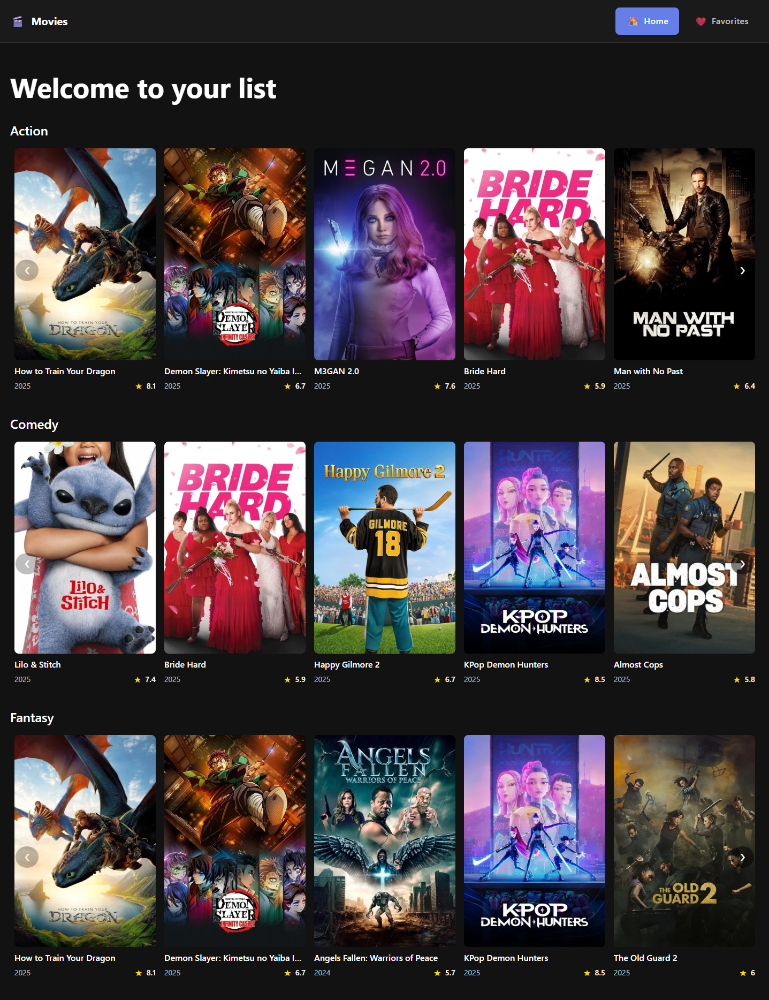
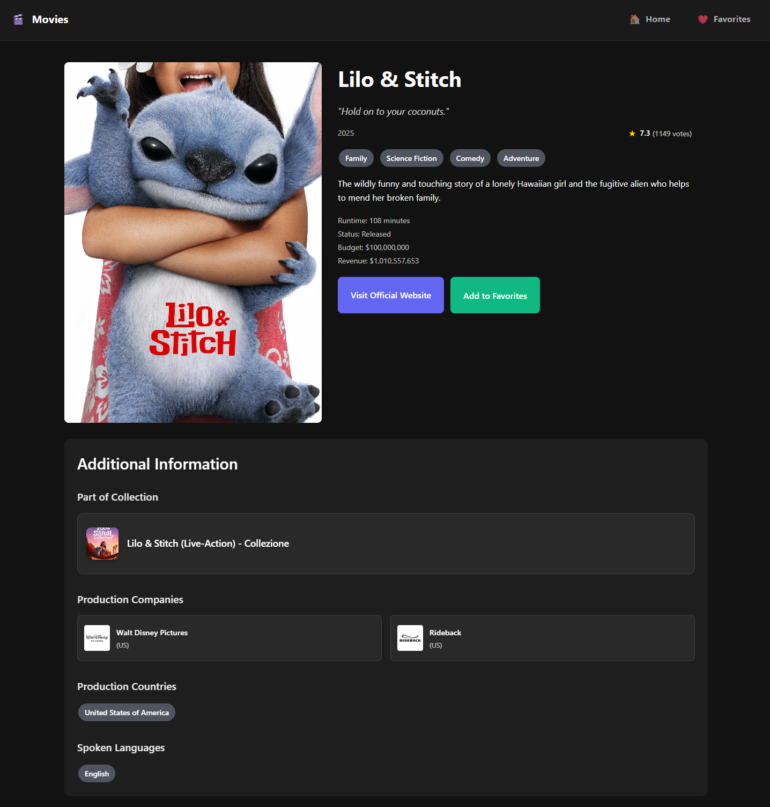
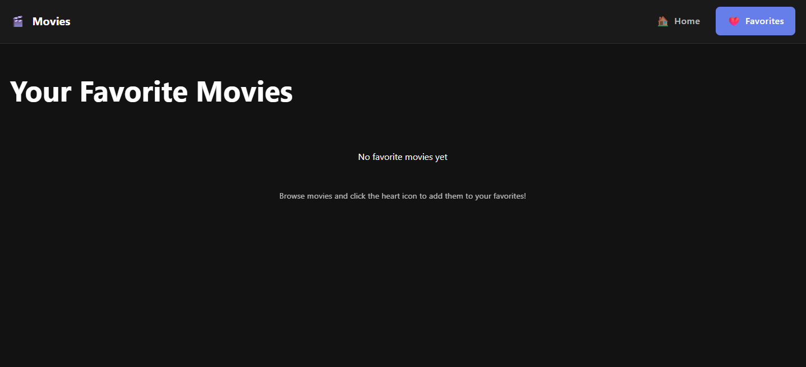
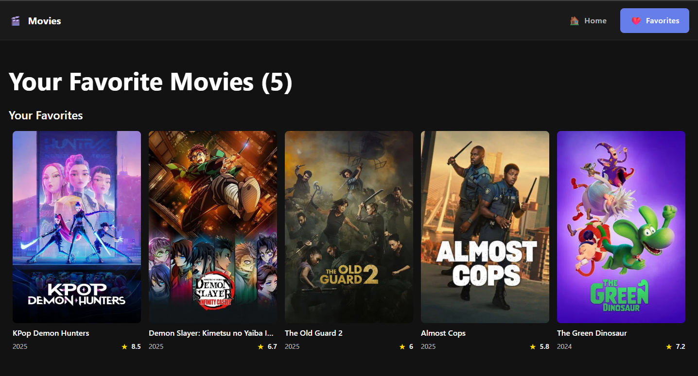

# My Movies 🎬

A modern React application for browsing and discovering movies using The Movie Database (TMDB) API. Built with TypeScript, React Router, and Sass for a responsive and interactive movie browsing experience.

You can check the demo project [here](https://my-movies-ashy.vercel.app/). 😊

## 📸 Screenshots

### Home Page
Browse movies by genre with beautiful carousels showcasing Action, Comedy, and Fantasy films.



### Movie Details
Get comprehensive information about any movie including cast, production details, ratings, and more.



### Favorites - Empty State
Clean and intuitive empty state when you haven't added any favorites yet.



### Favorites - With Movies
Your favorite movies displayed in an organized carousel format.



## 🚀 Features

- **Movie Discovery**: Browse movies by genre (Action, Comedy, Fantasy)
- **Detailed Movie Information**: View comprehensive movie details including cast, production info, and ratings
- **Favorites System**: Mark movies as favorites with persistent local storage
- **Responsive Design**: Optimized for desktop and mobile devices
- **Modern UI Components**: Custom carousel, pills, ratings, and interactive buttons
- **Real-time Data**: Fresh movie data from TMDB API (only shows the last 20 movies for simplicity)
- **Fast Navigation**: Smooth routing between pages

## 📋 Prerequisites

Before you begin, ensure you have the following installed:
- **Node.js** (version 16 or higher)
- **npm** or **yarn** package manager
- **TMDB API Key** (free registration required at [themoviedb.org](https://www.themoviedb.org/))

## 🛠️ Setup Instructions

### 1. Clone the Repository
```bash
git clone https://github.com/lucasvallejodev/my-movies.git
cd my-movies
```

### 2. Install Dependencies
```bash
npm install
```

### 3. Environment Configuration
Create a `.env` file in the root directory by copying the example:
```bash
copy .env.example .env
```

### 4. Configure Environment Variables
Edit the `.env` file and add your TMDB API key:

```env
VITE_TMDB_API_KEY=your_actual_api_key_here
VITE_TMDB_BASE_URL="https://api.themoviedb.org/3"
VITE_TMDB_POSTER_IMG_URL="https://image.tmdb.org/t/p/w500"
```

**How to get a TMDB API Key:**
1. Visit [themoviedb.org](https://www.themoviedb.org/)
2. Create a free account
3. Go to Settings → API
4. Request an API key (choose "Developer" option)
5. Copy your API key and paste it in the `.env` file

### 5. Start the Development Server
```bash
npm run dev
```

The application will be available at `http://localhost:5173`

## 🌍 Environment Variables

| Variable | Description | Required | Default Value |
|----------|-------------|----------|---------------|
| `VITE_TMDB_API_KEY` | Your TMDB API key for accessing movie data | ✅ Yes | - |
| `VITE_TMDB_BASE_URL` | Base URL for TMDB API endpoints | ❌ No | `https://api.themoviedb.org/3` |
| `VITE_TMDB_POSTER_IMG_URL` | Base URL for movie poster images | ❌ No | `https://image.tmdb.org/t/p/w500` |
| `VITE_TMDB_ORIGINAL_IMG_URL` | Base URL for movie detail images | ❌ No | `https://image.tmdb.org/t/p/original` |
| `VITE_TMDB_LOGO_URL` | Base URL for movie companies logo images | ❌ No | `https://image.tmdb.org/t/p/w200` |

## 🧪 Available Scripts

| Command | Description |
|---------|-------------|
| `npm run dev` | Start development server |
| `npm run build` | Build for production |
| `npm run preview` | Preview production build |
| `npm run lint` | Run ESLint |
| `npm run test` | Run tests with Vitest |
| `npm run test:ui` | Run tests with UI |
| `npm run test:coverage` | Run tests with coverage report |

## 🔧 Technologies Used

- **Frontend Framework**: React 19 with TypeScript
- **Routing**: React Router DOM v7
- **Styling**: Sass
- **Build Tool**: Vite
- **Testing**: Vitest + Testing Library
- **Linting**: ESLint
- **API**: The Movie Database (TMDB) API

## 🚀 Deployment

### Build for Production
```bash
npm run build
```

The built files will be in the `dist/` directory, ready for deployment to any static hosting service.

### Deployment Options
- **Vercel**: Connect your GitHub repository for automatic deployments
- **Netlify**: Drag and drop the `dist` folder or connect via Git
- **GitHub Pages**: Use GitHub Actions for automated deployment

## 🔮 Future Enhancements

- **Search Functionality**: Search movies by title, actor, or director
- **User Authentication**: User accounts and personalized recommendations
- **Favorites Persistence**: Save favorites to a database
- **Movie Trailers**: Integrate YouTube API for movie trailers
- **Advanced Filtering**: Filter by year, rating, genre combinations
- **Watchlist Feature**: Separate watchlist from favorites
- **Social Features**: Share movies and reviews

## 🐛 Troubleshooting

### Common Issues

**API Key Not Working**:
- Ensure your TMDB API key is valid and active
- Check that the `.env` file is in the root directory
- Restart the development server after adding environment variables

**Movies Not Loading**:
- Verify the TMDB API is accessible
- Check browser console for error messages

**Build Errors**:
- Run `npm install` to ensure all dependencies are installed
- Check for TypeScript errors with `npm run lint`

## 📄 License

This project is open source and available under the [MIT License](LICENSE).

**Happy movie browsing! 🍿**